## 嵌入式端常见安全方案

- [device-UID encrypt](#device-UID encrypt)
- [Debug-port restrict](#DEBUG-PORT RESTRICT)
- [External encrypted ASIC](External encrypted ASIC)
- [SMART Card / IC CARD](SMART Card / IC CARD)

## ATTACKER

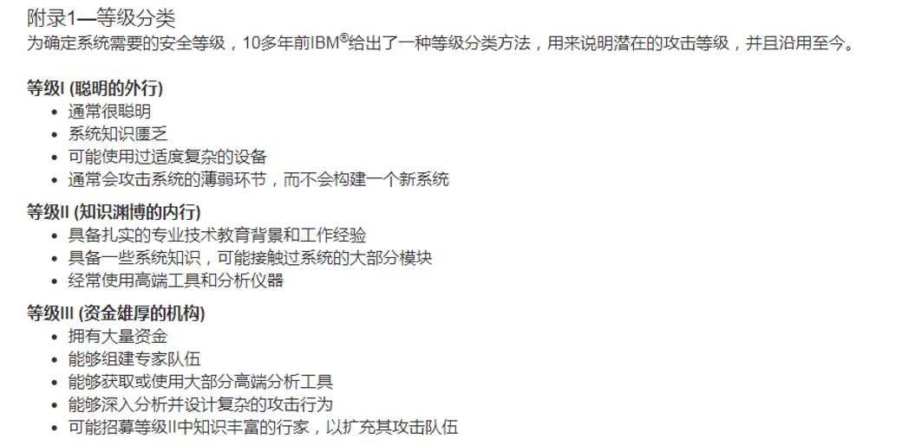

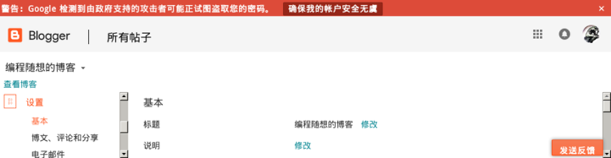

更大的攻击力量-ZF

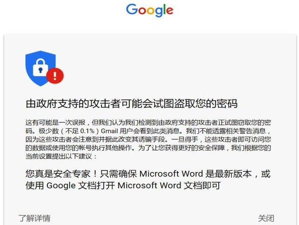

## Professional Attack measures

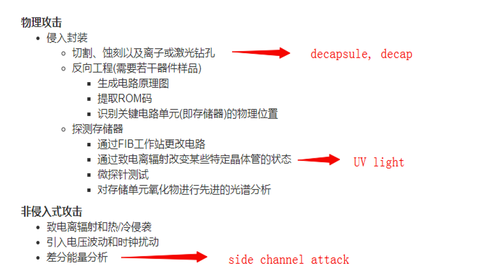

### device-UID encrypt

目前很多mcu都具有唯一设备id=uid.  产品生产时需要输入由uid产生的hash 激活码验证. 产生的序列号对应唯一的激活码。激活码的算法产生依赖与设备序列号，算法不对外公开。当输入激活码时，软件在内部进行对比校验.匹配即可正常使用 否则受限.

常用的hash:

* MD5

* SHA224 256

### DEBUG-PORT RESTRICT

Flash read protection (use OptionByte)

* Level1 = no protect.

* Level2 = read out protect.

* Level3 = disable debug port connection.

## External encrypted ASIC

* Judge system main control.

* Typical model: ATSHA204 

* Core mechanism: security key hash compare.

* High security level. 

## SMART Card / IC CARD

* 安全程度最高, 一般用在银行卡, sim卡, 各种金融系统中.

* 成本高.

* Architecture: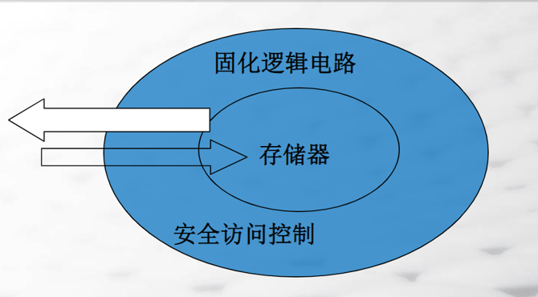

智能卡 – CPU TYPE

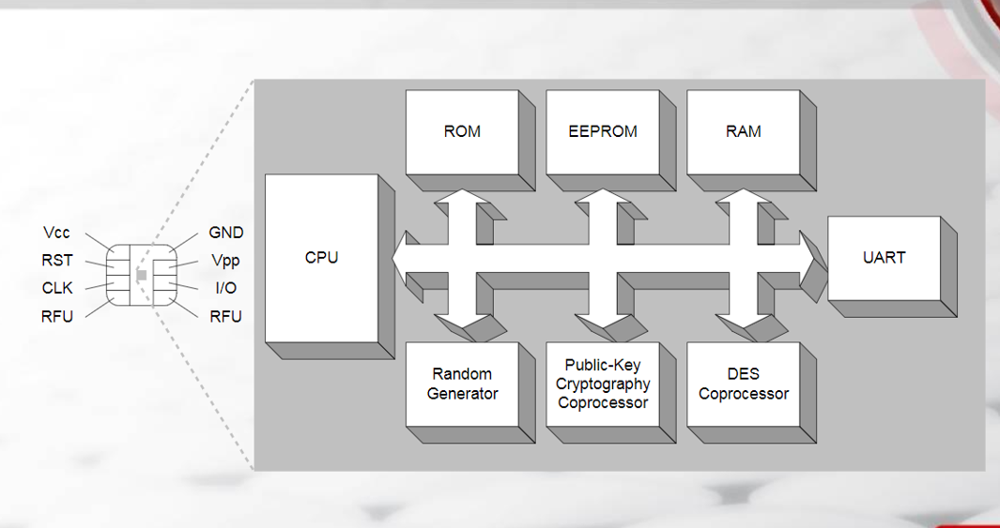

卡片安全认证---卡是真的?

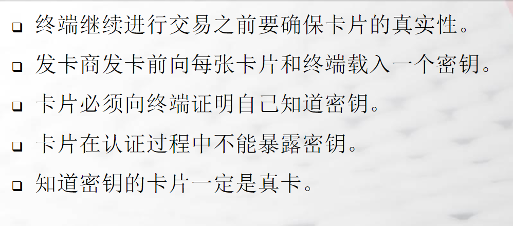

终端安全验证---终端是真的?

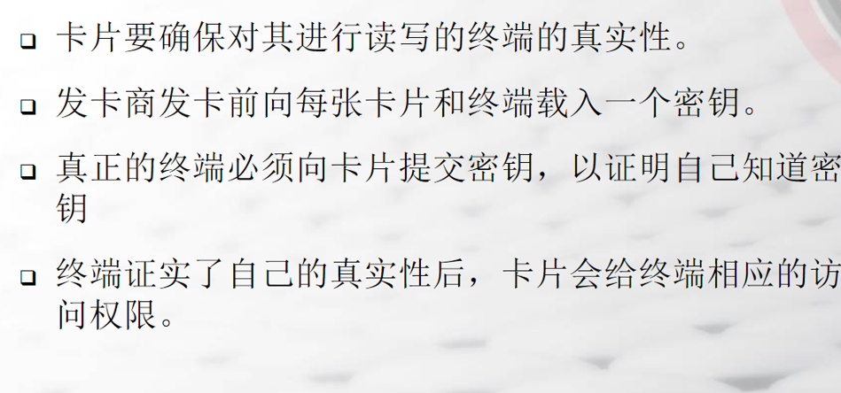

交易认证

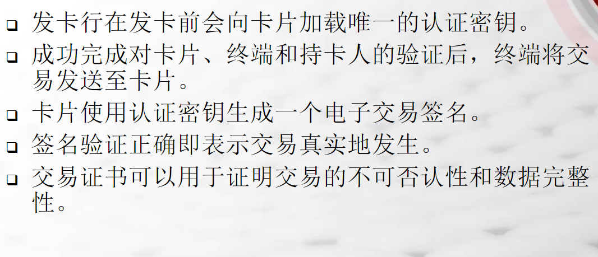

## IC DECAP

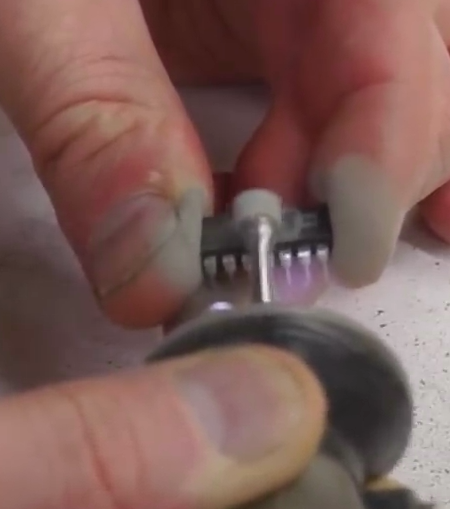

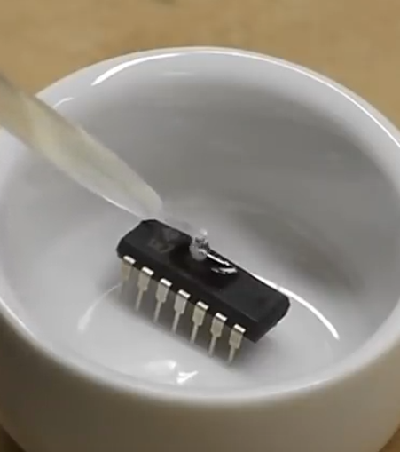

显微镜下定位FLASH后利用UV光照射

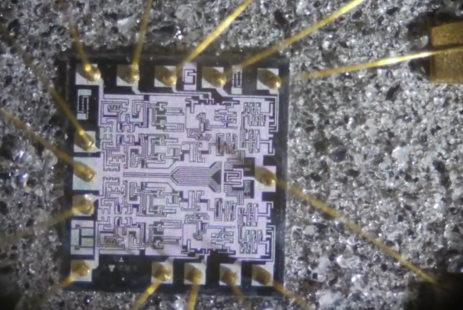

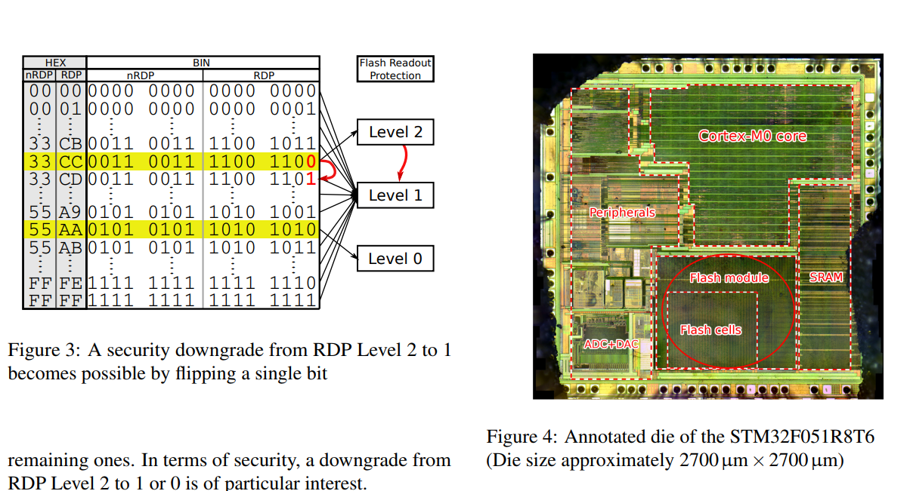

## Protect Level

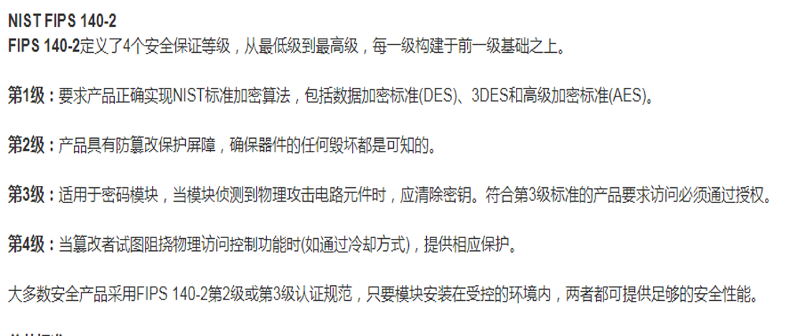

Reference

> * 《嵌入式安全系统的发展趋势》-Maxin AN3976
> * *shedding too much light on a mcu firmware protection*

## Decompile

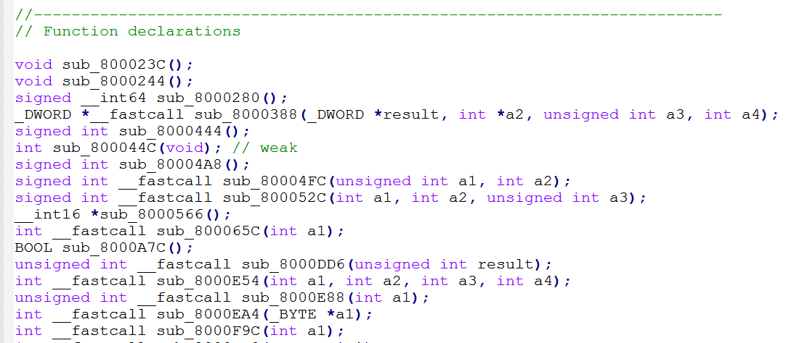

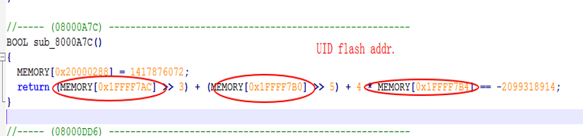

SWD DEBUG-PORT DUMP

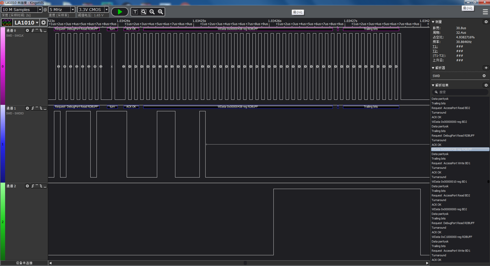

