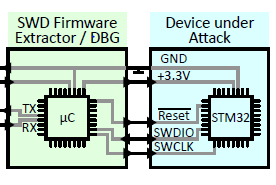
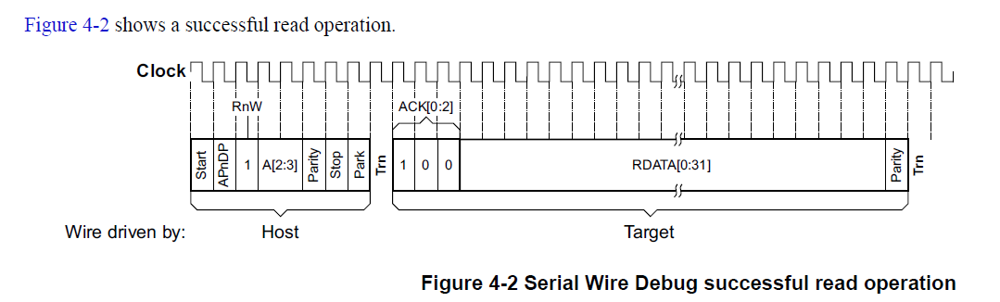
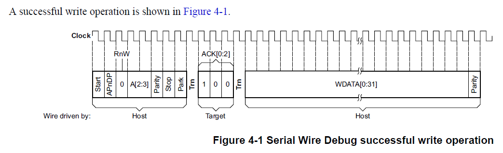
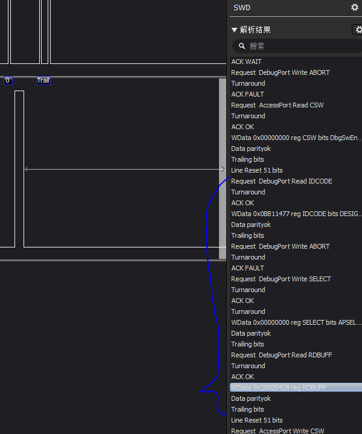

# 一种攻击stm32f0系列mcu的办法

本文介绍一种攻击stm32f0系列mcu的办法,可以将设置了RDP level1 (debug接口读保护)的mcu的固件读出.

## 1.简述

对于常规F0单片机,通过设置flash 的 option byte后可以保护固件被他人利用jlink 等debugger读出. 具体现象是当使用jlink swd连接mcu后 用jflash软件的read back功能,会返回错误,并且警告如果继续将会触发flash mass erase(全片擦除).点击确定后flash读到全是FFFFFFFFF,并且MCU flash里面已经没有固件了.

这是stm32f0系列flash保护的机制 datasheet或者rm写的:

> RDP Level 1 keeps the debug interface active but restricts access to flash memory. **As soon as a debugger is connected, flash memory is locked.** It can neither be read out directly nor indirectly via DMA nor is the CPU able to execute code from it. Protection can be upgraded to RDP Level 2 but can also be downgraded to RDP Level 0 at the cost of losing all flash memory contents.

被设置读保护的MCU主要有2种运行模式:用户模式和debug模式. 当一个debugger接入的时候mcu会切换到debug模式.一旦系统进入debug模式, 通过debugger或者mcu访问flash会被拒绝,flash此时被锁住 变成不可用状态, 任意一个简单的读操作都会触发bus error然后引发hard fault中断.但是更深的机制就没有写清楚了.

## 2.深入分析debug接口-swd协议和flash lock的机制.

因为普通debugger比如jlink st-link一旦接入都导致flash锁住,为了深入分析背后的原因,需要自制一个debugger,并且实现swd协议.因为swd是公开的并且有详细的协议文档可以查询. 而且接近硬件底层自由度高,这样方便我们测试哪个cmd会导致flash lock.

- 1.准备一个stm32f0的最小系统板.称为目标板(device under attack.)

* 2.编写一个简单的led闪烁的程序,并设置RDP1. 当flash被lock引发hard fault就可以立刻看出.

* 3.再准备一个stm32f0的核心板 (攻击板 attack board),要能控制目标板的电源通断和nRESET引脚 方便在hard fault之后重启/复位.

整个系统方案框图:

{width="5.2173906386701665in" height="3.1819444444444445in"}

第一个mcu还是要通过jlink连接电脑, 用普通IO来模拟SWD协议实现SWDIO和SWCLK.

SWD协议其实比较简单.read和write请求:

请求由packet header 1 byte组成.包含R/W, parity, addr等消息.

SWDIO的驱动方向Host-\>target和target-\>host 利用turn around=Trn请求来切换.

不过swclk始终由host来驱动

{width="5.768055555555556in" height="1.742361111111111in"}{width="5.768055555555556in" height="1.7583333333333333in"}

数据WDATA后接的parity使用偶校验even, 即该位+所有WDATA里的1的个数总数为偶数=校验正确.

测试发现大部分SWD请求都不触发保护机制直到访问系统bus,例如(AHB-Lite).

只访问SWD内部reg都没有问题,系统仍然正常运行.

但只要debugger使用系统bus访问任意模块 比如外设,SRAM,FLASH,就会进入debug mode,然后flash lock down.

debugger通过读取或写入SWD AHB访问端口（AHB-AP）R/W reg来触发系统总线上的传输。

也就是说假如我要读取某addr上的data, 先向AHB-AP端口发送读或者写请求,之后的数据也是从AHB-AP传过来.

更仔细的分析表明，AHB传输以及因此锁定是由相应SWD数据包传输的最后一个上升SWCLK边沿触发的.也就是请求读bus会触发flash lock.

为了尽量少的干扰和减轻分析的工作量,将SWD的协议尽可能精简,移除那些不必要的操作.

精简的初始化过程包括 line reset, 总线发送50+个clk的时候swdio保持1即可完成reset.

接下来读取DP的IDCODE(即target的调试接口id.)

精简的初始化之后,可以发现flash仍然没有被lock.

下一步,试图发送一个读flash的request将会触发系统bus访问,这是为了触发flash lock.然而经过大量测试发现,极少数情况下,有一些数据会紧随着read buff返回.而这些数据就是flash里的固件.如果可以的话,仅能在第一次成功, 后续再尝试访问都会返回SWD ERROR.为了重复读取,需要下电再上电来复位target系统.

读取访问成功率是随机的,因为这是一种典型的时间竞速条件.而后续测试bus 负载与成功率相关.

测试两个固件,一个总是执行NOP指令, 另一个总是执行STR执行(将reg的数存到mem).

NOP那个固件100%能读取成功,而STR总是失败.

参考cortex m0权威指南. **CPU取指令和取数据的总线优先级要高于debug访问**.因此调试器总是必须等待总线空闲时期才发出请求.如果debugger获得即时的总线访问权限,访问就能发生在flash lock之前,这时候竞争条件发生,数据可以被读出. 另外的情况下,调试器访问时被持续的cpu访问延迟,flash将拒绝随后到达的读取尝试.

总结:该漏洞是由于时钟系统设计缺陷导致的.

受保护固件dump:

1.  上电 system reset.

2.  a.  发起swd line reset.

    b.  Debugger 从SWD-DP端口读取IDCODE reg

    c.  Debugger设置CTRL/STAT reg的两个bit CSYSPWRUPREQ (power up req) 和 CDBGPWRUPREQ (debug power up req).

3.  Set SWD access width = 32bit. (default=8bit) (set AHB-AP的Control/Status Word reg = 0x02)

4.  Set flash source addr(想要读取的地址, 这个addr会被发送到AHB-AP的Transfer Address Reg, aka. TAR)

5.  Debugger 请求读取AHB-AP的Data Read/Write Reg, aka. DRW

6.  5的操作将会读取DP的Read Buffer Reg, 如果成功会返回SWD OK的ack 还有该addr的数据, 否则是SWD ERROR.

7.  如果6成功, Addr+=4. 然后循环1-6. 从而dump整个flash出来.

这些协议相关细节可以从 \<ARM Debug Interface V5\>里面的SW-DP找到.

以下是逻辑分析仪抓取的时序(逻辑分析仪可以更直观的学习时序)

{width="5.768055555555556in" height="6.9118055555555555in"}