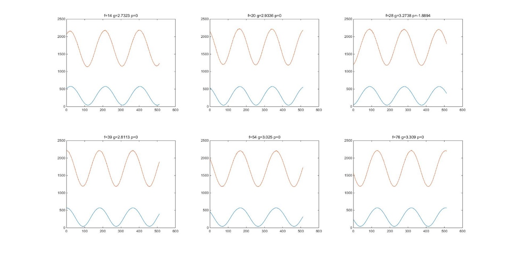

## 背景:

荧光子弹需要紫外光LED光照一段时间充能才能发出荧光.为了测试某恒定LED光强下达到最短光照时间以及荧光子弹光衰数据, 搭建一个简易方便的数据采集分析系统.

数据采集整体框架.

Pc使用python设定相关参数: 光照时间t, fs, 采样点数 etc..

MCU使用自带ADC 根据pc设定的采样率fs进行采集后通过uart将数据回传.

Python可以直接对数据简单处理,或者保存成csv方便导入matlab进行更进一步采集.

Ex1: ADC dual channel mode cfg.(strict sample multiple channel at same time)

Ex2: adc sample rate automatic cfg.

Py & mcu 自定简易通信协议. eg:

1.  Py send '\#t=1000' , '\#f=1000', '\#sc=1024'

> (时间=1000ms, 采样率1000hz, 采样点数1024)

2.  Mcu 解析uart接收的命令. 配置参数后进行采样. 在采样完成的DMA传输完成IRQ里将数据上传upload.

串口助手抓到的数据格式(字符串)

采集adc值 + 换行

**adc1 , adc2 + '\\r\\n'**

123,333

124,334

120,330

Xxx,xxx

## Python实现简易串口读写与存储.

1.  环境搭建:

```python
pip install serial
```

2. 包含头文件

```python
import serial
```

3. 按照参数打开串口

```python
ser = serial.Serial('com19', 115200) 
ser.set_buffer_size(rx_size=20480) #为了设置合适的缓冲区
if ser.isOpen(): #检查是否打开成功
	print('open port successful')
```

4. 发送数据

```python
data = b'f=' + bytes(fs, encoding='ascii') + b'\r\n' ser.write(data) #only bytes array is supported.
```

5.读取数据

```python
while True: #开一个线程读取rx buffer的数据
		time.sleep(2)
cnt = ser.inWaiting() #bytes to read in rx buffer
if (cnt > 0):
	data = ser.read(cnt)
	lines = str(data, encoding='ascii') #转码成字符串
break
```


## 保存成csv用于存档或者导入matlab.

```
csv_file = open(f_name + '.csv' , 'w') #创建并打开一个文件
csv_file.write(lines) #如果接收时已经是csv格式可以直接写入
for i in range(len(_in)): #或者解析成list后再按需存入
csv_file.write(_in[i] + ',' + _out[i] + '\n')
csv_file.close() #写完记得关闭.
```


## matlab 读取 csv文件

```matlab
M = csvread(csv\_name); %返回M是一个矩阵.M(:,1) 可以取第一列.%(ch1的数据):表示所有行M(:,2) 可以取第二列, 以此类推.
plot(M); %按默认 画出图
title( \[\'f=\' num2str(freq)\])%画图后title函数用于加上格式化的标题
```


## 关于绘图

1.  同一张图绘制多条曲线:

```
Plot(y1);

Hold on;

Plot(y2);
```


2.  同一个页面绘制多张图用于对比:

```
figure(1); %创建画布.

subplot(1, 2, 1);%在1行\*2列里,画第1个图

subplot(1, 2, i);

%在1行\*2列的格子画第i个图 ,1\<i\<=总数
```


例如subplot(2, 3, i)就是这样的.i=1\~6

{width="5.768055555555556in" height="2.8930555555555557in"}

## Ex1: ADC dual channel mode cfg.(strictly sample multiple channel at same time)

多ADC同时规则采样配置(严格的同时,同一时钟边沿采样)步骤

(单ADC在同一时间最多只能采样1个channel)

1.  stm32f4支持最多3ADC同时采样,称为dual mode/ triple mode.

2. 多ADC时, ADC1=master, ADC2/3 = slave.

   只可能存在2种搭配,dual:ADC1+ADC2. Triple:ADC1+ADC2+ADC3.

   多ADC无法同时采集同一个pin.

3. 如果开启DMA传输, 只需要为master(也就是ADC1) 配置即可.

   Slave会由master进行触发转换.

   DMA的src data addr 配置成专门的ADC-CDR 寄存器.

   单个data size = word. 在dual mode时, 相当于ADC1+ADC2分别在高半字和低半字

## Ex2: adc sample rate automatic cfg.

要计算ADC采样率, 需要单次转换所需时钟周期tc cycle和ADC时钟频率 fa.

单次转换cycle = sampling cycle + n-bit resolution cycle.

例如配置为 3 sampling cycle, 12bit采样时, 总共需要的转换时间= 15cycle.也就是每15个ADC clock 可以采样一次.

然后对于STM32F4, ADC clock 来自APB2 clock. 于是fa与APB2分频值APB2\_clk\_div以及ADC配置的ADC\_CLK\_DIV相关.

将这些所有可能的分频值adc\_div, apb2\_clk\_div与单次转换周期tc组合起来,可以构成i\*j\*k种组合方式.然后取手册上可行的ADC clock范围(0.6M\~36Mhz)来计算可以所有算出可配置的ADC采样率fs.